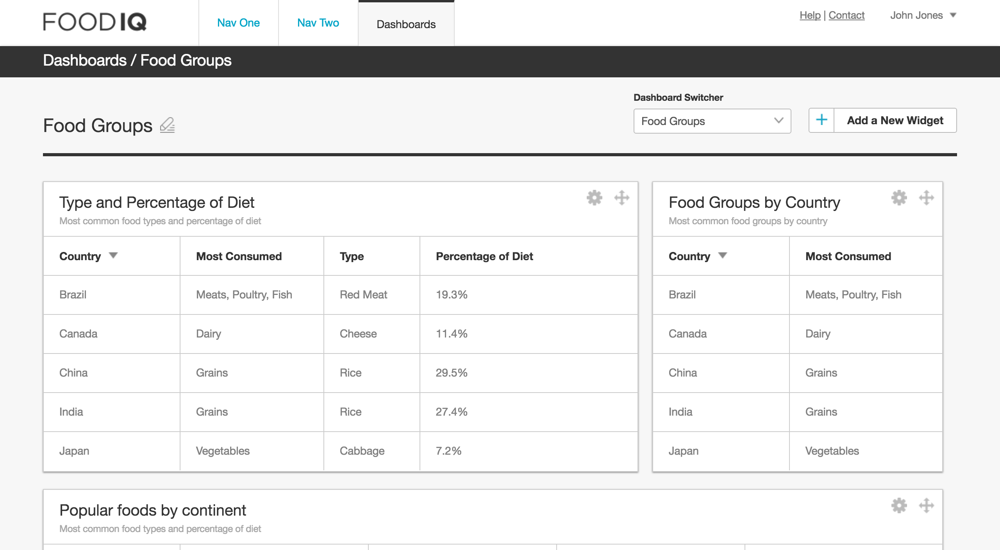
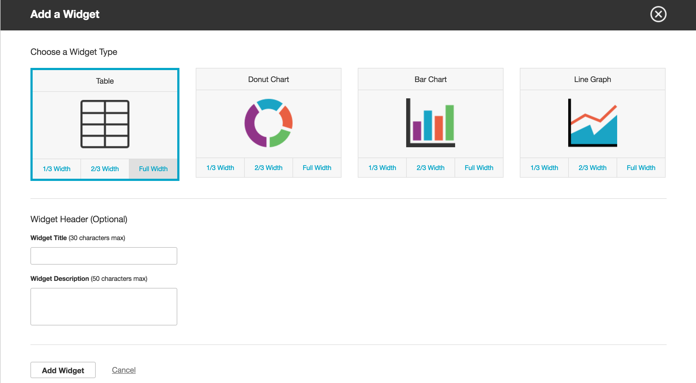

# Dashboard

]

]

## Description

This customizable dashboard allows users to change the dashboard name, add
widgets of different sizes, give widgets names and descriptions, and drag and
drop them. Currently, only table widgets can be added to the dashboard.

The dashboard is built with React.js and jQuery, utilizing Webpack for module
compilation and Babel to transpile JSX. The drag and drop interface is built
using high-order components provided by [React DnD].

[React DnD]: <https://github.com/gaearon/react-dnd/>

## Local Deployment

To run this app on your local system, download this repository and run
```npm install```. In order to modify the application, run ```webpack```
or ```webpack --watch``` to recompile the modules in ```bundle.js```.
